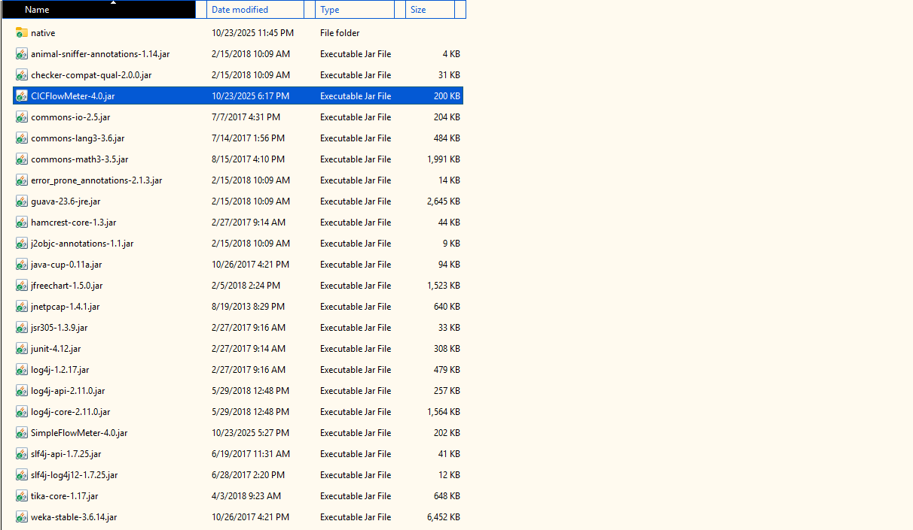
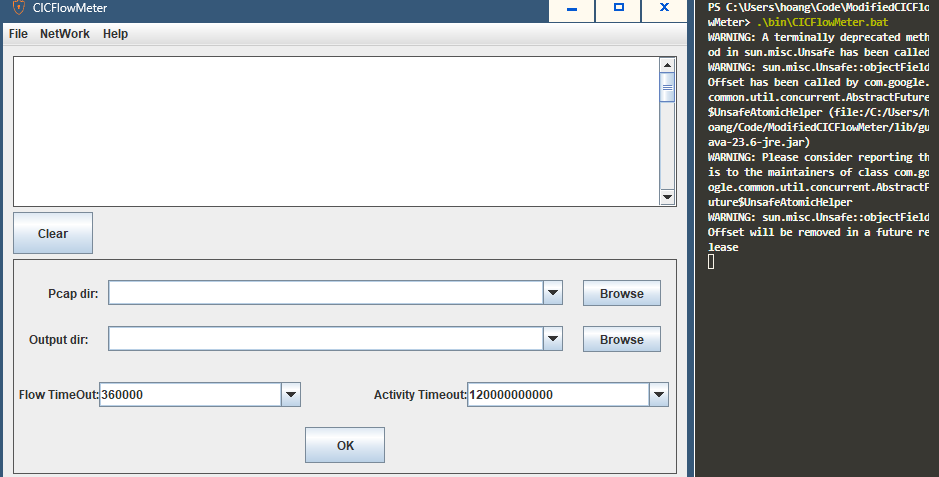

# CICFlowMeter - 
Tác giả gốc của mã nguồn của tool này là các tác giả của: bài báo "Characterization of Tor Traffic Using Time Based Features" [1] và "Characterization of Encrypted and VPN Traffic Using Time-Related Features" [2]

## Mục tiêu sử dụng
Mã nguồn này đã được can thiệp để phù hợp với mục tiêu khóa luận của tôi. Tôi sử dụng mã nguồn này với mục đích học tập và nghiên cứu, không có mục đích kiếm tiền hoặc vụ lợi nào khác.

## Vấn đề của mã nguồn gốc
Khi compile bằng Maven/Gradle, đôi khi lib (jnetpcap, ...) sẽ không được load tự động vào file java. Sau khi tham khảo từ các nguồn khác nhau, tôi có tổng hợp được source của một video trên youtube [[3]], bây giờ mọi người có thể dễ dàng tùy chỉnh và sử dụng cho dự án của mình.

## Cách sử dụng (Offline Mode - Convert pcap to csv)
Trước tiên, chúng ta cần một trình biên dịch để biên dịch mã nguồn thành các file jar:

```
### Windows 
mvnd / mvn package

### Linux
mvn package
```

Sau đó copy file ```CICFlowMeter-4.0.jar``` (tầm 200KB) vào thư mục lib (chứa sẵn các thư viện cần thiết):


Cuối cùng sử dụng file bat trong thư mục bin ```CICFlowMeter.bat``` để chạy cửa sửa GUI:


Kết quả sau khi chạy:


## Reference
[1]: Arash Habibi Lashkari, Gerard Draper-Gil, Mohammad Saiful Islam Mamun and Ali A. Ghorbani, "Characterization of Tor Traffic Using Time Based Features", In the proceeding of the 3rd International Conference on Information System Security and Privacy, SCITEPRESS, Porto, Portugal, 2017

[2]: Gerard Drapper Gil, Arash Habibi Lashkari, Mohammad Mamun, Ali A. Ghorbani, "Characterization of Encrypted and VPN Traffic Using Time-Related Features", In Proceedings of the 2nd International Conference on Information Systems Security and Privacy(ICISSP 2016) , pages 407-414, Rome , Italy.

[3]: https://www.youtube.com/watch?v=EaYyYy9uvt0